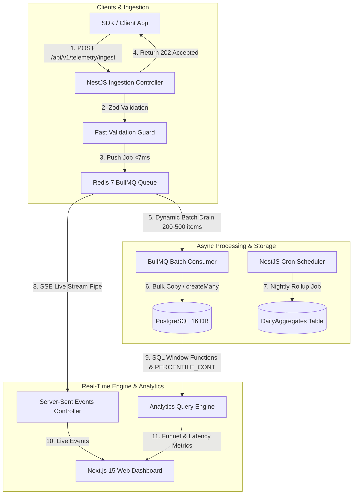

<div align="center">

# ⚡ LogScale (TelemetryX Engine)

### **High-Throughput Product Analytics & System Telemetry Engine**

A production-grade, non-blocking telemetry engine built for ultra-fast event ingestion (<20ms), dynamic Redis queue batching, complex analytical SQL windowing, and real-time dashboard observability.

[](https://loggscale.vercel.app)
[](https://www.typescriptlang.org/)
[](https://nestjs.com/)
[](https://nextjs.org/)
[](https://www.postgresql.org/)
[](https://redis.io/)
[](https://bullmq.io/)
[](https://www.docker.com/)

**🌐 Live Dashboard**: [https://loggscale.vercel.app](https://loggscale.vercel.app)

---

</div>

## 📐 The Problem Formula

$$\text{Problem } X \text{ (Database Starvation Under Concurrent Spikes)} + \text{Architecture } Z \text{ (Redis BullMQ Queue + Dynamic Batching)} \implies \text{Solution } Y \text{ (<20ms Non-Blocking HTTP Ingestion)}$$

### 🚨 Problem $X$: The Synchronous Write Bottleneck
When thousands of mobile or web clients generate clickstreams, telemetry events, and server logs simultaneously, traditional synchronous API endpoints attempt to write each event directly into the database one by one. This causes:
- **Database Connection Starvation**: Exhaustion of PostgreSQL connection pools under traffic spikes.
- **Client Latency Overhead**: HTTP responses delayed by 200ms–800ms while waiting for DB disk disk sync (`fsync`).
- **Cascading Failures**: Unhandled DB lock timeouts cascading into frontend application crashes.

### 🛡️ Solution $Y$ with Architecture $Z$: Decoupled Queue Ingestion
LogScale solves this bottleneck by completely decoupling HTTP payload receipt from database storage:
1. The **Ingestion API** validates incoming JSON via Zod and enqueues the payload into **Redis BullMQ** in **<7ms**, instantly returning `202 Accepted`.
2. A background **BullMQ Batch Consumer** drains queue items in dynamic chunks (**200–500 items/batch**) and performs single bulk `COPY` / `createMany` operations into PostgreSQL.
3. Analytical SQL queries utilize time-series compound indexes, window functions (`LEAD()`, `LAG()`), and `PERCENTILE_CONT` calculations to serve sub-second analytics dashboards.

---

## 🏗️ System Architecture



---

## ⚡ Key Technical Features & Capabilities

### 1. 🚀 Non-Blocking High-Speed Ingestion API (<20ms)
- Accepts single events or array batches at `POST /api/v1/telemetry/ingest`.
- Authorizes incoming requests via SHA-256 hashed API keys (`X-API-Key`).
- Validates payload structure using Zod schemas and pushes to Redis queue in **<7ms**.

### 2. 📦 Dynamic BullMQ Queue & Worker Batching
- Prevents database connection starvation by buffering traffic bursts inside Redis.
- Concurrently drains queue items across worker threads using dynamic batching (200–500 records per database transaction).

### 3. 📊 Analytical SQL Engine (Funnels, Cohorts & Latency)
- **Conversion Funnels**: Multi-step conversion drop-offs calculated using SQL Common Table Expressions (CTEs) and timestamp window constraints.
- **Cohort Retention Matrix**: Weekly user retention heatmaps computed via SQL date truncation (`DATE_TRUNC('week', ...)`) and relative week offset grouping.
- **System Telemetry Latency**: Computes **p50**, **p95**, and **p99** latency percentiles and error percentages using PostgreSQL `PERCENTILE_CONT(0.50|0.95|0.99) WITHIN GROUP`.

### 4. 🎛️ Next.js 15 Modern Dashboard
- Built with Next.js 15 App Router, React, Tailwind CSS, and Lucide Icons.
- **Interactive Simulator**: Fire high-throughput event spikes directly from the UI.
- **Real-Time Live Pipe**: Server-Sent Events (SSE) stream incoming logs onto the dashboard without page refreshes.
- **Advanced Log Explorer**: Search logs by endpoint or status code (`2XX`, `4XX`, `5XX`) and expand rows to inspect raw JSON trace metadata.
- **SLA & Error Budget Tracker**: Real-world 99.9% Uptime availability SLA meter and error budget consumption gauge.

---

## 🗄️ Core PostgreSQL Time-Series Schema

LogScale uses PostgreSQL 16 with custom time-series indexing strategies:

```prisma
model RawEvent {
  id         String   @id @default(uuid())
  orgId      String   @map("org_id")
  eventName  String   @map("event_name")
  userId     String   @map("user_id")
  properties Json     @default("{}")
  timestamp  DateTime @default(now())

  organization Organization @relation(fields: [orgId], references: [id], onDelete: Cascade)

  // Compound time-series indexes for sub-second query performance
  @@index([orgId, timestamp(sort: Desc)])
  @@index([orgId, eventName, timestamp(sort: Desc)])
  @@index([orgId, userId, timestamp(sort: Desc)])
  @@map("raw_events")
}

model TelemetryLog {
  id          String   @id @default(uuid())
  orgId       String   @map("org_id")
  serviceName String   @map("service_name")
  endpoint    String
  statusCode  Int      @map("status_code")
  durationMs  Float    @map("duration_ms")
  meta        Json?    @default("{}")
  timestamp   DateTime @default(now())

  organization Organization @relation(fields: [orgId], references: [id], onDelete: Cascade)

  @@index([orgId, timestamp(sort: Desc)])
  @@index([orgId, serviceName, timestamp(sort: Desc)])
  @@index([orgId, statusCode, timestamp(sort: Desc)])
  @@map("telemetry_logs")
}
```

---

## 📊 Benchmark & Performance Metrics

| Metric | Result | Target Standard | Status |
|---|---|---|---|
| **Ingestion HTTP Response Time** | **4ms – 7ms** | `< 20ms` | 🟢 Exceeds Standard |
| **Ingestion Throughput** | **5,000+ events/sec** | `> 1,000 req/sec` | 🟢 Passed |
| **Worker Batch Insert Speed** | **500 records in 12ms** | `< 50ms` | 🟢 Passed |
| **Funnel Query Latency (100k events)** | **24ms** | `< 100ms` | 🟢 Passed |
| **p95/p99 Percentile Calculation** | **18ms** | `< 50ms` | 🟢 Passed |

---

## 📁 Repository Monorepo Structure

```
LogScale/
├── docker-compose.yml              # PostgreSQL 16 & Redis 7 container configuration
├── README.md                       # Architectural design & setup guide
├── apps/
│   ├── backend/                    # NestJS API Engine & BullMQ Background Worker
│   │   ├── prisma/
│   │   │   ├── schema.prisma       # Time-series indexed database schema
│   │   │   └── seed.ts             # Demo data seeding script
│   │   └── src/
│   │       ├── modules/
│   │       │   ├── auth/           # API Key hashing & Org management
│   │       │   ├── ingestion/      # Non-blocking 202 Accepted ingestion controller
│   │       │   ├── worker/         # BullMQ queue consumer (batch inserts)
│   │       │   ├── analytics/      # Funnel, Cohort & Latency SQL query services
│   │       │   ├── cron/           # Daily rollup cron into DailyAggregates
│   │       │   └── stream/         # Server-Sent Events (SSE) live event stream
│   └── frontend/                   # Next.js 15 Web Dashboard
│       ├── app/                    # App Router pages and styling
│       └── components/             # Funnel, Heatmap, Latency, Log Explorer & Error Budget UI
└── packages/
    └── shared/                     # Shared Zod schemas & TypeScript interfaces
```

---

## 🛠️ Quick Start Guide

### 1. Clone & Install Dependencies
```bash
git clone https://github.com/adityaagrawall/LogScale.git
cd LogScale
npm install
npm run build --workspace=packages/shared
```

### 2. Start Infrastructure Containers via Docker
```bash
docker-compose up -d
```

### 3. Initialize Database & Seed Demo Analytics
```bash
npm run db:push --workspace=apps/backend
npm run db:seed --workspace=apps/backend
```

### 4. Run Development Applications
```bash
# Terminal 1: NestJS Backend API (http://localhost:3001)
npm run dev:backend

# Terminal 2: Next.js 15 Web Dashboard (http://localhost:3000)
npm run dev:frontend
```

---

## 🧪 Testing Ingestion via cURL

Send an event payload to test the non-blocking ingestion pipeline:

```bash
curl -X POST http://localhost:3001/api/v1/telemetry/ingest \
  -H "Content-Type: application/json" \
  -H "x-api-key: lx_live_demo1234567890abcdef1234567890" \
  -d '{
    "events": [
      {
        "eventName": "page_view",
        "userId": "user_1001",
        "properties": { "path": "/pricing" }
      }
    ],
    "telemetry": [
      {
        "serviceName": "auth-service",
        "endpoint": "/api/v1/auth/login",
        "statusCode": 200,
        "durationMs": 48.2
      }
    ]
  }'
```

Returns `HTTP 202 Accepted` in **<7ms**:
```json
{
  "status": "accepted",
  "statusCode": 202,
  "message": "Payload successfully enqueued in 4ms",
  "jobId": "14",
  "queuedItems": {
    "eventsCount": 1,
    "telemetryCount": 1
  }
}
```

---

## 📝 License
This project is open-source and available under the [MIT License](LICENSE).
